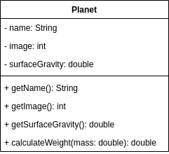
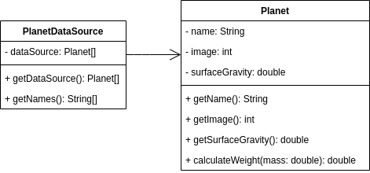

# COMP 730/830 Lab 2 - Your Weight On Other Planets
## Objectives
- Practice

## Instructions
1. Review the starter code. The main activity layout is already implemented for you. In this lab you will 
   need to complete the `MainActivity` class and create `Planet` and `PlanetDataSource` classes.
   No need to modify any files in the `res` directory.
    
2. Create the `Planet` class. Refer to this class diagram. 
   
   
   
   It should have the following attributes: name, image id, and surface gravity. 
   All attributes should be read only and initialized in the constructor. The `Planet` should also have
   a function that calculates the weight on the planet based on mass provided. Formula for the weight is:
   ```
   weight = mass * surface_gravity
   ``` 
The following table includes the approximate value of surface gravity (`g`) on different astronomical entities. 
| Name    | g     |
|---------|-------|
| Mercury | 0.377 |
| Venus   | 0.905 |
| The Moon| 0.1654|
| Mars    | 0.379 |
| Jupiter | 2.528 |
| Saturn  | 1.065 |
| Uranus  | 0.886 |
| Neptune | 1.137 |
| Pluto   | 0.063 |

3. Create the `PlanetDataSource` class. The purpose of this class is to act as a wrapper for the Planets 
objects. It should have an array of planets initialized in its constructor. It should allow to read
   the planets array and the array of the planets' names. 
   Your class structure should look like this.
   
   

4. Add `PlanetDataSource` instance to the `MainActivity` class.

5. Implement `OnClickListener` for the `calculateButton`.

6. Setup `planetSelectView`. First you will need to create and set an Adapter. Here is an example
of initializing a simple `ArrayAdapter` to display planet names.
```java
ArrayAdapter adapter = new ArrayAdapter(
      this,
      android.R.layout.simple_spinner_item,
      planetDataSource.getNames()
);
adapter.setDropDownViewResource(android.R.layout.simple_spinner_dropdown_item);
planetSelectView.setAdapter(adapter);
```

7. Implement `OnItemSelectedListener` for the `planetSelectView`.

8. Implement `recalculateWeight` function. It should update the view based on entered weight and
selected planet. Hints on how to update the view:
   * To read the entered text in `weightEditText` view use `getText().toString()` property. 
   * To get the position of the selected planet use `planetSelectView.getSelectedItemPosition()`.
   * To set new image of a planet use `planetImageView.setImageResource(imageId)`
   * To display the result ` weightOnPlanetLabel.setText(resultText)`